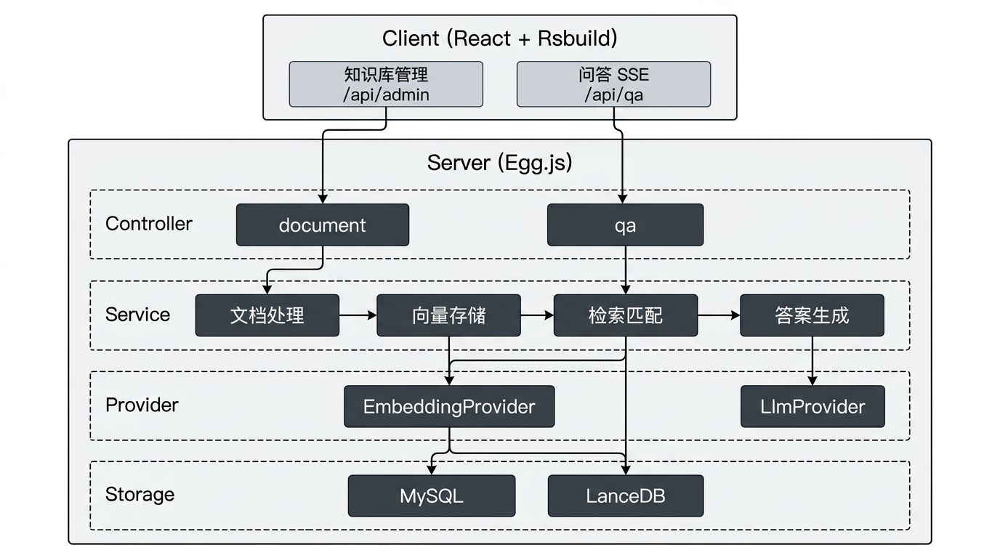

# 从领域建模到流式问答：基于 DDD + OpenSpec 规格驱动的 RAG 知识库 AI 实践


## 📖 一、项目概述

基于企业自有知识库的 **RAG（检索增强生成）AI 问答系统**。📄 上传知识库后自动清洗、分块、向量化入库；💬 用户提问后检索最相关片段，交由 🤖 大模型生成带引用来源的答案，✨ 前端 SSE 流式展示。

📐 项目采用 DDD 领域建模 + OpenSpec 规格驱动开发，每次变更都有设计文档和规格可追溯，架构边界清晰、迭代可控。

📎 [项目运行指南](https://github.com/11Extrano/rag-kb-qa-system/blob/main/docs/项目运行.md) ｜ 📋 [事件风暴（领域建模）](https://github.com/11Extrano/rag-kb-qa-system/blob/main/docs/事件风暴.md)

<br/>

## 🧩 二、设计方法论：DDD × OpenSpec（SDD）

### 为什么不是 Vibe Coding？

当前 AI 辅助编程有一种流行方式叫 **Vibe Coding** —— 需求直接丢给 AI，一把生成代码，"凭感觉"迭代。写 Demo 很快，但稍微复杂一点就容易失控：

| 维度 | Vibe Coding | 本项目（DDD + OpenSpec） |
|------|------------|-------------------------------|
| **需求管理** | 口头描述，容易遗漏和歧义 | 每个能力有独立 Spec，需求可追溯 |
| **架构质量** | AI 自由发挥，模块边界模糊 | 先事件风暴确定领域边界，再设计再编码 |
| **可维护性** | 改一处牵一片，无规格约束 | 每次变更有 Proposal → Design → Specs → Tasks → Apply → Archive 全链路 |
| **团队协作** | 仅存在于个人对话历史 | 变更归档沉淀为项目资产，新人可直接阅读 |
| **迭代可控性** | 下一轮对话可能推翻上一轮 | 增量变更基于已有 Spec，严格受控 |

### 设计流程

```
事件风暴（领域建模）
    ↓
DDD 界限上下文划分（4 大领域）
    ↓
OpenSpec Propose（生成 Proposal + Design + Specs + Tasks）
    ↓
OpenSpec Apply（按 Tasks 逐项实现，代码与规格同步）
    ↓
OpenSpec Archive（归档变更，Delta Spec 合入主 Spec）
```

**DDD 领域划分**：通过事件风暴识别出 8 个领域事件、4 个界限上下文：

| 界限上下文 | 职责 | 核心事件 |
|-----------|------|---------|
| 知识库处理 | 上传 → 清洗 → 分块 | 知识库上传完成、文本清洗完成、文本拆分完成 |
| 向量存储 | Embedding → 持久化 | 向量生成完成、向量存储完成 |
| 检索匹配 | 语义检索 → 结果组装 | 检索请求接收、相关知识库片段匹配完成 |
| 答案生成 | Prompt 编排 → LLM 生成 | 答案生成完成 |

依赖方向：**知识库处理 → 向量存储 → 检索匹配 → 答案生成**，与事件流完全一致。

**OpenSpec（SDD 规格驱动开发框架）**：项目累计经过 4 轮变更，每轮都产出 Proposal → Design → Specs → Tasks 一套完整文档，全部归档可追溯：

| 变更 | 内容 |
|------|------|
| `setup-rag-kb-qa-system` | 从零搭建 RAG 全链路 |
| `support-stream-output` | SSE 流式输出 + 打字机效果 |
| `support-pdf` | PDF 知识库支持 |
| `embedding-batch-size-limit` | Embedding 批量限制适配 |

<br/>

## 🏗️ 三、技术架构

### 技术栈一览

| 层级 | 技术选型 | 说明 |
|------|---------|------|
| 前端 | React 18 + TypeScript + **Rsbuild** + Ant Design 5 | Rsbuild 基于 Rspack（Rust 编写），冷启动和 HMR 速度远超 Webpack |
| 后端 | Egg.js + TypeScript + Sequelize | 约定式 MVC，Controller → Service → Model 分层清晰 |
| 关系存储 | MySQL | 存知识库元数据 + 文本片段原文 |
| 向量存储 | **LanceDB**（嵌入式） | Node 同进程、零运维、数据落本地目录 |
| 大语言模型 | OpenAI（通过 Provider 抽象） | 基于 OpenAI 兼容协议，可切换 Qwen / DeepSeek / Claude 等 |
| Embedding | OpenAI text-embedding | 同样走 Provider 抽象，可按需替换其他向量化模型 |
| 容器化 | Docker Compose | 可选，MySQL 一键启动 |

### 架构图



<br/>

## ✨ 四、技术亮点与难点

### 1. 两段式分块策略（标题感知 + 固定长度 + Overlap）

分块质量直接决定检索效果。固定长度硬切会切断语义，纯按标题切又没法控制片段大小。所以这里做了**两段式组合**：

**第一段 — 按 Markdown 标题切分（可选）**：用正则 `^(#{1,6})\s+(.+)$` 识别标题层级，将知识库内容切为若干「语义大块」，每块携带所属标题作为 metadata，检索时保留上下文语境。

**第二段 — 递归分隔符 + 固定长度 + Overlap**：对每个大块再进行精细切分：
- **递归分隔符优先级**：`\n\n` → `\n` → `。？！` → `. ? !` → 空格，尽可能在自然语义边界断句
- **固定长度控制**：每块不超过 500 字符（可配置），避免单块过大导致检索噪声
- **Overlap 重叠**：相邻块间保留 50 字符重叠区，防止关键信息恰好落在分块边界被截断

这些参数都通过环境变量配置，不同业务场景可以随时调整。

### 2. 双存储架构：MySQL + LanceDB 分工协作

| 存储 | 职责 | 原因 |
|------|------|------|
| MySQL | 知识库元数据 + 文本片段原文 | 支持关系查询、事务、状态管理 |
| LanceDB | 向量 + chunk_id | 只做相似度检索，不冗余存储原文 |

**检索流程**：query 向量化 → LanceDB top-k 检索得到 `[chunk_id, score]` → MySQL 关联查询取原文和来源名 → 组装匹配结果交给 LLM。

LanceDB 作为嵌入式向量库（Node 同进程），零运维、无网络开销；相似度公式 `score = 1 / (1 + _distance)` 归一化到 (0, 1] 区间。

### 3. SSE 流式输出 + 前端打字机效果

**服务端**：采用 **Server-Sent Events（SSE）** 协议，定义四种事件类型：

| 事件 | 数据 | 含义 |
|------|------|------|
| `chunk` | 文本片段 | 答案的增量文本 |
| `citations` | JSON 数组 | 引用来源（知识库条目名、片段、相似度） |
| `done` | `{}` | 流结束 |
| `error` | 错误信息 | 异常时先发 error 再关闭连接 |

后端通过 `AsyncGenerator` 将 LLM 流式输出（`chatStream`）逐 chunk 转发为 SSE 事件，从 LLM 到浏览器全链路都是流式的，没有中间缓冲。

**客户端**：因为 SSE 需要 POST 请求体（`EventSource` API 仅支持 GET），采用 `fetch` + `ReadableStream` + `TextDecoder` 手动解析 SSE 协议：

```typescript
const reader = res.body.getReader();
const decoder = new TextDecoder();
// 按 \n\n 拆分 SSE 事件，解析 event: 和 data: 字段
// onChunk 回调追加文本 → React 状态更新 → ReactMarkdown 渲染 → 打字机效果
```

每收到一个 `chunk` 事件，通过 `setState` 追加到 `answer` 字符串，React 重渲染即产生逐字显示的打字机效果。同时支持 `AbortController` 中断请求。

### 4. 大模型集成：OpenAI 兼容协议 + Provider 抽象

LLM 和 Embedding 都通过 **OpenAI SDK** 调用，统一走 OpenAI 兼容协议，上层业务不感知具体模型：

- **LlmProvider**：封装 `chat`（一次性）和 `chatStream`（流式 AsyncGenerator）两种调用模式
- **EmbeddingProvider**：封装 `embed`（单条）和 `embedBatch`（批量，内部按 10 条分批适配 DashScope 等平台限制）

当前接入 OpenAI（对话 + Embedding），切换模型只需要改环境变量（`LLM_BASE_URL`、`LLM_MODEL`、`EMBEDDING_MODEL` 等），业务代码完全不用动。Qwen、DeepSeek、Claude 或者其他 OpenAI 兼容接口都能直接对接。

### 5. Top-K 可配置检索：只喂最相关的内容给 LLM

用户提问后，系统**不会把知识库所有分块都塞给 LLM**，而是只取向量相似度最高的 Top-K 条。这么做的考虑：

- LLM 按 token 计费，全量灌进去 prompt 会很长、成本也高
- 低相关度的片段混进上下文，反而会干扰模型输出质量
- 上下文越短 LLM 推理越快，用户等首字的时间也越短

K 值通过环境变量 `RETRIEVAL_TOP_K` 配置（默认 5）。精确问答场景可以调低，综合分析场景可以调高，不用改代码。

### 6. Prompt 工程：减少幻觉 + 引用追溯

系统 Prompt 明确约束 LLM **仅根据检索到的参考内容回答**，无法回答时直接说明而非编造：

```
你是一个知识库助手。请仅根据下面【参考内容】回答用户问题；
若参考内容中无法得到答案，请说明并不要编造。
```

参考内容按编号 + 来源知识库条目名的格式拼进 prompt。LLM 生成答案后，匹配到的片段（条目名、原文、相似度分数）作为 `citations` 一起返回，用户可以逐条核实来源。

### 7. Rsbuild 构建

前端构建用的 **Rsbuild**（底层是 Rspack，Rust 写的 Webpack 兼容打包器），比 Webpack 快不少：
- 冷启动和 HMR 基本秒级，开发体验很好
- 配置量很小，React 插件、路径别名、API 代理都是内置的
- 生产构建也快，不用额外折腾优化配置

<br/>

## 📁 五、项目目录结构

```
rag-kb-qa-system/
├── client/                          # 前端
│   ├── src/
│   │   ├── api/index.ts             # API 封装（含 SSE 流式解析）
│   │   ├── pages/
│   │   │   ├── QaPage.tsx           # 问答页（打字机效果）
│   │   │   └── DocumentsPage.tsx    # 知识库管理页
│   │   ├── types/index.ts           # 类型定义
│   │   ├── App.tsx                  # 根布局 + 路由
│   │   └── index.tsx                # 入口
│   └── rsbuild.config.ts            # Rsbuild 构建配置
│
├── server/                          # 后端（Egg.js）
│   ├── app/
│   │   ├── controller/              # ──── 接口层（Interface）────
│   │   │   ├── document.ts          #   知识库上传/列表/删除，参数校验 + 调用应用层
│   │   │   └── qa.ts                #   问答入口，SSE 流式分支，协议适配
│   │   │
│   │   ├── service/                 # ──── 应用层 + 领域层（Application & Domain）────
│   │   │   │                        #   【知识库处理域】
│   │   │   ├── documentProcessing.ts #   领域核心：文本提取 + 清洗 + 两段式分块
│   │   │   │                        #   【向量存储域】
│   │   │   ├── vectorStore.ts       #   领域核心：LanceDB 向量读写 + Top-K 检索
│   │   │   │                        #   【检索匹配域】
│   │   │   ├── retrievalMatch.ts    #   领域核心：语义检索 + MySQL 关联 + 结果组装
│   │   │   │                        #   【答案生成域】
│   │   │   ├── answerGeneration.ts  #   领域核心：Prompt 编排 + 答案生成（含流式）
│   │   │   │                        #   ──── 基础设施层（Infrastructure）────
│   │   │   ├── embeddingProvider.ts  #   外部依赖封装：Embedding API（OpenAI 兼容）
│   │   │   └── llmProvider.ts       #   外部依赖封装：LLM API（OpenAI 兼容）
│   │   │
│   │   └── model/                   # ──── 领域模型（Domain Model）────
│   │       ├── document.ts          #   实体：知识库条目（元数据 + 状态机）
│   │       └── chunk.ts             #   值对象：文本片段
│   │
│   └── config/                      # Egg 配置（含 RAG 参数）
│
├── docs/                            # 项目文档
│   ├── 项目运行.md                  # 运行指南
│   └── 事件风暴.md                  # DDD 领域建模
│
├── openspec/                        # OpenSpec 规格与变更
│   ├── specs/                       # 当前规格（5 个能力域）
│   └── changes/archive/             # 已归档变更（4 轮迭代）
│
├── docker-compose.yml               # 可选：MySQL 容器
└── .env.example                     # 环境变量模板
```

<br/>

## 🔄 六、核心数据流

```
用户提问 "XX产品怎么使用？"
         │
         ▼
    EmbeddingProvider.embed(question)
         │  → 768 维向量
         ▼
    VectorStore.search(queryVector, topK=5)
         │  → [{chunkId, score}, ...]
         ▼
    MySQL: 用 chunkId 关联查询 Chunk + Document
         │  → [{text, docName, score}, ...]
         ▼
    AnswerGeneration: 组装 Prompt
         │  System: "仅根据参考内容回答"
         │  User: [参考内容1] [参考内容2] ... + 问题
         ▼
    LlmProvider.chatStream(messages)
         │  → AsyncGenerator<string>
         ▼
    QaController: 逐 chunk 写 SSE
         │  event: chunk / citations / done
         ▼
    前端: fetch + ReadableStream 解析
         │  onChunk → setState 追加文本
         ▼
    ReactMarkdown 渲染（打字机效果）
```

<br/>

## ❓ 七、设计决策 FAQ

**Q：为什么选 LanceDB 而不是 Pinecone / Milvus？**
> LanceDB 是嵌入式向量库，与 Node 同进程运行、零部署成本、数据落本地目录。对于中小规模知识库完全够用，且避免了引入额外基础设施的运维复杂度。若后续需分布式扩展，模块边界清晰，替换 VectorStore 实现即可。

**Q：分块策略为什么要两段式？**
> 纯固定长度切分会切断语义完整性；纯按标题切分无法控制片段大小，导致检索到的上下文过大或不均匀。两段式先按标题保留语义边界，再按长度 + overlap 精细控制，兼顾语义完整性和检索精度。

**Q：为什么用 fetch + ReadableStream 而不是 EventSource？**
> 浏览器原生 `EventSource` 仅支持 GET 请求，无法携带 POST body。问答接口需要 POST 传递 question，因此用 `fetch` 获取 `ReadableStream`，手动按 SSE 格式（`\n\n` 分隔、`event:` / `data:` 前缀）解析，同时通过 `AbortController` 支持用户中断。

**Q：如何保证 LLM 不编造答案？**
> 两方面：一是 System Prompt 约束"只根据参考内容回答，答不了就说不知道"；二是答案附带 citations（片段原文 + 相似度分数），用户可以点开看具体是哪段知识库内容支撑了这个回答。

**Q：OpenSpec 和 Vibe Coding 的核心区别？**
> Vibe Coding 是"对话驱动"，上下文仅存在于聊天历史，容易丢失、无法复用。OpenSpec 是"规格驱动"，每次变更都生成 Proposal → Design → Specs → Tasks 的完整制品链，归档后成为项目资产，支持增量迭代和团队协作，本质上是把软件工程的严谨性引入 AI 辅助开发流程。

<br/>

## 📌 八、总结

这个项目不只是跑通一个 RAG Demo，更多是在实践**怎么用工程化的方式做 AI 项目**：

- 设计上先做事件风暴和领域划分，再用 OpenSpec 管理每次变更，不是想到哪写到哪
- 架构上双存储分离、Provider 抽象、流式全链路打通，模块之间边界清晰，换模型或换向量库都不影响其他部分
- 工程上 Rsbuild 保证开发体验、SSE 做流式交互、Prompt 约束减少幻觉，这些细节加起来才是一个能用的系统
